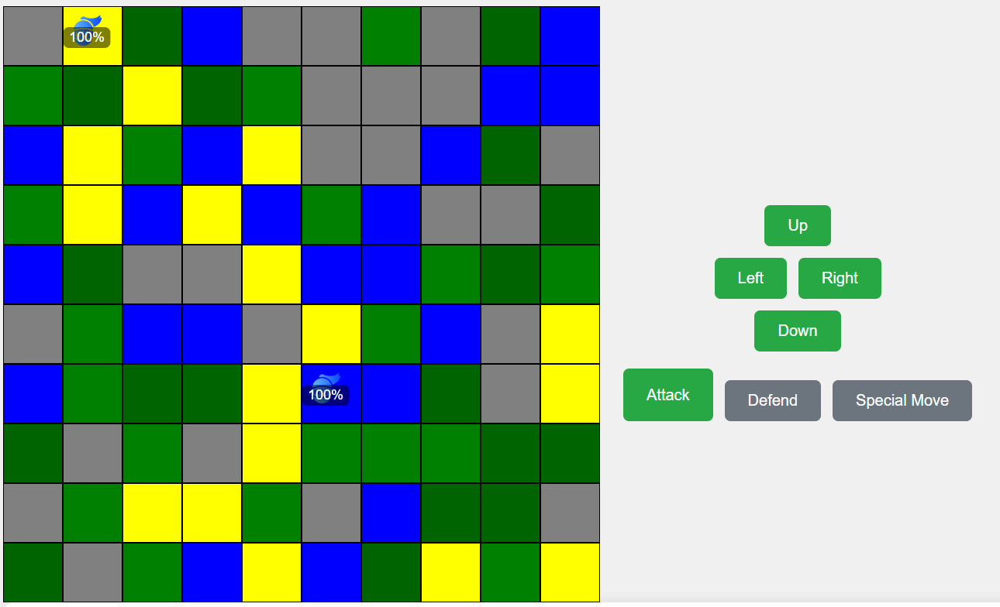

# Duel Masters AI vs Human

An AI-powered game where players duel against an AI opponent.

## Introduction

This project is a web-based game developed to provide a challenging opponent for players using artificial intelligence. It is our first game development project, created by Tinashe and Lloyd. The game is designed to test and enhance players' strategic skills against a sophisticated AI, ensuring an engaging and competitive gaming experience.

## Installation

To set up the project locally, follow these detailed steps:

1. **Clone the repository:**
    ```bash
    git clone https://github.com/llorugwe/duel-masters-ai-vs-human
    cd duel-masters-ai-vs-human
    ```

2. **Install dependencies for both the frontend and backend:**
    ```bash
    # Install backend dependencies
    cd backend
    npm install

    # Install frontend dependencies
    cd ../frontend
    npm install
    ```

3. **Set up environment variables:**
    - Create a `.env` file in the root of your backend directory and add your MongoDB URI:
        ```
        MONGODB_URI=your-mongodb-uri
        JWT_SECRET=yourSecretKey
        ```

4. **Run the project:**
    ```bash
    # Start backend server
    cd backend
    npm start

    # Start frontend server
    cd ../frontend
    npm start
    ```

## Usage

Once the setup is complete, open your browser and navigate to `http://localhost:3000` to start playing the game. The AI will provide a challenging opponent, making each game a unique and engaging experience.

## Contributing

Contributions are welcome! Please follow these steps to contribute:

1. **Fork the repository**
2. **Create a new branch:**
    ```bash
    git checkout -b my-feature-branch
    ```
3. **Make your changes and commit them:**
    ```bash
    git commit -m 'Add some feature'
    ```
4. **Push to the branch:**
    ```bash
    git push origin my-feature-branch
    ```
5. **Submit a pull request**

## Related Projects

Here are some related projects you might find interesting:
- [Project 1](https://github.com/username/project1)
- [Project 2](https://github.com/username/project2)

## Licensing

This project is licensed under the MIT License.

## Screenshot



## Links

- [Deployed Site](https://duel-masters-ai-vs-human-8949c70bd62b.herokuapp.com/)
- [Tinashe's LinkedIn](https://www.linkedin.com/in/tinashe-guhwa-086281145)
- [Lloyd's LinkedIn](https://www.linkedin.com/in/lloyd-nyarugwe-b4566a114)

## Technical Details and Personal Story

### Challenges and Solutions

One of the main challenges faced during development was implementing the AI's decision-making process. Ensuring the AI provided a competitive and fair challenge required extensive testing and fine-tuning. We used advanced algorithms to enhance the AI's performance, creating a more dynamic and engaging opponent for players.

### Personal Story

Our inspiration for this project came from a shared passion for both game development and artificial intelligence. As our first game, it represents a significant milestone in our careers. We aimed to create a project that not only showcases our technical skills but also provides a fun and challenging experience for players.

### Future Iterations

Future iterations of this project could include:
- Adding more game modes and difficulty levels.
- Enhancing the AI's learning algorithms to adapt to players' strategies.
- Integrating social features to allow players to compete against each other online.

### Visuals


By sharing our journey and the challenges we encountered, we hope to highlight our problem-solving skills and dedication to creating engaging user experiences. We are excited about the potential of this project and look forward to its future development.

